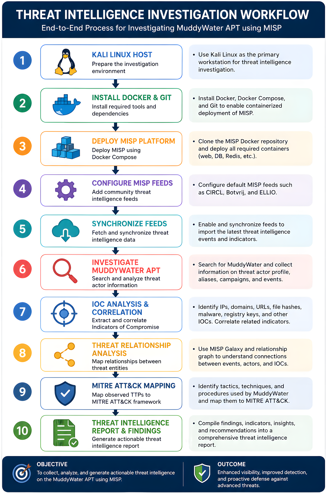

# 🛡️ MuddyWater Threat Intelligence Investigation with MISP


---

## Threat Intelligence Investigation using MISP to Profile the MuddyWater Advanced Persistent Threat (APT)

This project demonstrates how the **Malware Information Sharing Platform (MISP)** can be deployed using Docker to investigate a real-world Advanced Persistent Threat (APT). The investigation focuses on the **MuddyWater** threat group, leveraging community threat intelligence feeds to identify Indicators of Compromise (IOCs), correlate threat actor infrastructure, analyze adversary behavior, and map observed techniques to the **MITRE ATT&CK Framework**.

The project was conducted as a practical Threat Intelligence investigation for **SecureOps Cybersecurity Inc.**, simulating how a Security Operations Center (SOC) or Threat Intelligence Team would collect, enrich, and analyze intelligence to support proactive cyber defense.

---

## 📌 Business Challenge

SecureOps Cybersecurity Inc. supports organizations operating in government, finance, healthcare, and critical infrastructure sectors across Europe. The organization faces an increasingly sophisticated threat landscape driven by Advanced Persistent Threat (APT) groups targeting strategic assets through phishing campaigns, malware deployment, and infrastructure compromise.

One of the most prominent threat actors affecting SecureOps' clients is **MuddyWater**, an Iranian state-sponsored APT known for conducting espionage operations against government agencies, telecommunications providers, defense organizations, and critical infrastructure.

The growing volume of Indicators of Compromise (IOCs) collected from multiple intelligence sources created several operational challenges:

- Difficulty correlating threat intelligence from multiple community feeds.
- Delayed identification of malicious infrastructure.
- Limited visibility into adversary tactics, techniques, and procedures (TTPs).
- Slow production of actionable intelligence for incident responders and SOC analysts.

To address these challenges, SecureOps deployed the **Malware Information Sharing Platform (MISP)** to centralize threat intelligence, correlate Indicators of Compromise (IOCs), enrich threat data, and profile the MuddyWater threat actor using community intelligence feeds and MITRE ATT&CK mappings.

This project demonstrates how threat intelligence platforms can improve an organization's ability to identify, investigate, and respond to nation-state cyber threats through structured intelligence analysis.

## 🎯 Project Objectives

The primary objective of this project was to deploy the Malware Information Sharing Platform (MISP) and use it to investigate the **MuddyWater Advanced Persistent Threat (APT)** by collecting, analyzing, and correlating threat intelligence from community feeds.

### Specific Objectives

- Deploy the MISP platform using Docker in a controlled laboratory environment.
- Configure and enable default threat intelligence feeds within MISP.
- Collect Indicators of Compromise (IOCs) associated with the MuddyWater threat actor.
- Analyze malicious infrastructure, including IP addresses, URLs, domains, and file hashes.
- Profile the MuddyWater threat actor by identifying known aliases, motivations, targeted sectors, and notable campaigns.
- Correlate collected threat intelligence with MITRE ATT&CK techniques and adversary behaviors.
- Develop a structured threat intelligence report containing technical findings, IOC datasets, threat actor profiling, and recommended mitigation strategies.
- Demonstrate how Threat Intelligence Platforms (TIPs) enhance Security Operations Center (SOC) investigations and support proactive cyber defense.

### Expected Outcomes

Upon completion of the investigation, the project provides:

- A deployed and operational MISP instance.
- A structured repository of threat intelligence artifacts.
- A comprehensive IOC dataset exported from MISP.
- A detailed profile of the MuddyWater threat actor.
- MITRE ATT&CK mappings of observed adversary techniques.
- Actionable intelligence to support threat detection, incident response, and security monitoring.

- ## 🏗️ Threat Intelligence Investigation Workflow

The investigation followed a structured Threat Intelligence lifecycle, beginning with the deployment of the Malware Information Sharing Platform (MISP) and culminating in actionable threat intelligence reporting.

The workflow demonstrates how Indicators of Compromise (IOCs) were collected, correlated, enriched, and analyzed to build a comprehensive profile of the MuddyWater Advanced Persistent Threat (APT).

### Investigation Workflow

<p align="center">
  
</p>

### Workflow Description

1. **Deploy MISP using Docker**
   - Deploy the MISP Threat Intelligence Platform in a controlled laboratory environment using Docker containers.

2. **Configure Threat Intelligence Feeds**
   - Load the default MISP feed metadata.
   - Enable the first three community feeds.
   - Cache and import threat intelligence events.

3. **Threat Intelligence Collection**
   - Retrieve Indicators of Compromise (IOCs) from community threat intelligence sources.
   - Collect IP addresses, URLs, domains, file hashes, malware references, and related artifacts.

4. **Threat Actor Profiling**
   - Investigate the MuddyWater threat actor.
   - Identify aliases, motivations, targeted industries, campaigns, and associated infrastructure.

5. **Threat Correlation**
   - Correlate collected intelligence using MISP relationships.
   - Analyze links between malware, infrastructure, attack patterns, and adversary activity.

6. **MITRE ATT&CK Mapping**
   - Map observed behaviors to MITRE ATT&CK techniques.
   - Identify adversary tactics, techniques, and procedures (TTPs).

7. **IOC Export**
   - Export Indicators of Compromise (IOCs) as a CSV dataset for documentation, intelligence sharing, and future analysis.

8. **Threat Intelligence Reporting**
   - Produce a comprehensive threat intelligence report summarizing technical findings, IOC analysis, threat actor profiling, MITRE ATT&CK mappings, and mitigation recommendations.

---

## 🛠️ Technology Stack

| Technology | Purpose | Role in Project |
|------------|---------|-----------------|
| **MISP (Malware Information Sharing Platform)** | Threat Intelligence Platform | Collected, analyzed, correlated, and managed Indicators of Compromise (IOCs) and threat actor intelligence. |
| **Docker** | Containerization | Deployed and managed the MISP environment using Docker containers for consistent and reproducible deployment. |
| **Docker Compose** | Container Orchestration | Managed the MISP multi-container architecture, including supporting services such as the database and web application. |
| **Kali Linux** | Investigation Environment | Served as the primary operating system for deploying MISP and conducting threat intelligence investigations. |
| **Git** | Version Control | Managed project files and maintained version history throughout the investigation. |
| **GitHub** | Project Repository | Hosted the complete project documentation, screenshots, IOC dataset, and final investigation report. |
| **MITRE ATT&CK Framework** | Threat Modeling | Mapped MuddyWater adversary behaviors and Techniques, Tactics, and Procedures (TTPs) to industry-recognized ATT&CK techniques. |
| **Community Threat Intelligence Feeds** | Threat Intelligence Source | Supplied real-world threat intelligence events, Indicators of Compromise (IOCs), and threat actor information through MISP. |

### Core Skills Demonstrated

- Threat Intelligence Analysis
- Threat Actor Profiling
- IOC Collection and Correlation
- MITRE ATT&CK Mapping
- Threat Intelligence Feed Management
- Docker Deployment
- Threat Hunting
- Technical Documentation
- Cyber Threat Analysis
- Security Operations Center (SOC) Investigation

- ## 📂 Repository Structure

The repository is organized to separate project documentation, extracted threat intelligence artifacts, supporting resources, and implementation evidence.

```text
MuddyWater-Threat-Intelligence-with-MISP/
│
├── README.md
├── LICENSE
│
├── IOC_Data/
│   └── MuddyWater_IOCs.csv
│
├── Reports/
│   └── MuddyWater_Threat_Intelligence_Investigation_Report.pdf
│
├── Resources/
│   └── references.md
│
└── Screenshots/
    ├── 01_Project_Directory_Creation.png
    ├── 02_MISP_Docker_Repository_Cloned.png
    ├── 03_MISP_Docker_Project_Structure.png
    ├── 04_MISP_Core_Service_Started.png
    ├── 05_MISP_Docker_Stack_Healthy.png
    ├── 06_MISP_Login.png
    ├── 07_MISP_Default_Feed_Metadata_Loaded.png
    ├── 08_MISP_Default_Feeds_Enabled.png
    ├── 09_MISP_Threat_Intelligence_Events_Imported.png
    ├── 10_MuddyWater_Event_Overview.png
    ├── 11_Microsoft_Mango_Sandstorm_Profile.png
    ├── 12_MuddyWater_IOCs.png
    ├── 13_MuddyWater_Threat_Actor_Profile.png
    ├── 14_MuddyWater_Associated_Events.png
    ├── 15_MITRE_ATTACK_Mapping.png
    ├── 16_MuddyWater_Aliases.png
    ├── 17_MuddyWater_Threat_Relationship_Graph.png
    └── Threat_Intelligence_Investigation_Workflow.png
```

### Folder Description

| Folder | Description |
|----------|-------------|
| **IOC_Data/** | Contains the extracted Indicators of Compromise (IOCs) exported from MISP in CSV format. |
| **Reports/** | Contains the complete Threat Intelligence Investigation Report documenting the methodology, findings, IOC analysis, MITRE ATT&CK mappings, and recommendations. |
| **Resources/** | Contains supporting references and documentation used throughout the investigation. |
| **Screenshots/** | Contains implementation evidence documenting the deployment of MISP, threat intelligence feed configuration, IOC extraction, threat actor profiling, MITRE ATT&CK mapping, and relationship analysis. |

---

## 🔍 Investigation Process

The investigation followed a structured Threat Intelligence lifecycle to identify, analyze, and document Indicators of Compromise (IOCs) associated with the MuddyWater Advanced Persistent Threat (APT).

### Phase 1 — Environment Preparation

A dedicated Kali Linux virtual machine was prepared as the investigation workstation. Docker, Docker Compose, and Git were installed to support the deployment and management of the MISP Threat Intelligence Platform.

### Phase 2 — MISP Deployment

The official MISP Docker repository was cloned and deployed using Docker Compose. This provisioned the complete MISP environment, including the web application, database, Redis, and supporting services.

### Phase 3 — Threat Intelligence Feed Configuration

Default threat intelligence feeds were loaded into MISP. The CIRCL, Botvrij, and ELLIO feeds were enabled, cached, and synchronized to import the latest threat intelligence events and indicators.

### Phase 4 — Threat Actor Investigation

Using MISP's search capabilities, the MuddyWater threat actor was investigated to gather intelligence on:

- Known aliases
- Campaigns
- Targeted sectors
- Associated malware
- Threat events
- Adversary infrastructure

### Phase 5 — IOC Collection and Correlation

Indicators of Compromise (IOCs) associated with MuddyWater were extracted and analyzed, including:

- IP Addresses
- URLs
- Domains
- File Hashes
- Registry Keys
- External References

MISP correlation features were used to identify relationships between indicators and related threat events.

### Phase 6 — Threat Relationship Analysis

The MISP Relationship Graph was used to visualize connections between threat actors, malware, campaigns, events, and indicators, providing contextual intelligence that supports attribution and investigation.

### Phase 7 — MITRE ATT&CK Mapping

Observed adversary behaviors were mapped to the MITRE ATT&CK Framework to identify the tactics, techniques, and procedures (TTPs) employed by MuddyWater, improving detection and defensive planning.

### Phase 8 — Intelligence Reporting

The investigation concluded with the creation of a comprehensive Threat Intelligence Report documenting:

- Threat actor profile
- Indicators of Compromise (IOCs)
- MITRE ATT&CK mappings
- Threat relationships
- Technical findings
- Security recommendations

- ## 👤 Threat Actor Profile — MuddyWater

**MuddyWater** is an Advanced Persistent Threat (APT) group widely associated with cyber espionage campaigns targeting government agencies, telecommunications providers, defense organizations, energy companies, and other critical infrastructure. The group is known for combining spear-phishing, custom malware, and legitimate administration tools to gain and maintain access to victim environments.

### Threat Actor Overview

| Attribute | Details |
|-----------|---------|
| **Threat Actor** | MuddyWater |
| **Known Alias** | Mango Sandstorm (Microsoft) |
| **Threat Category** | Advanced Persistent Threat (APT) |
| **Primary Motivation** | Cyber Espionage |
| **Common Targets** | Government, Telecommunications, Defense, Energy, Critical Infrastructure |
| **Observed Region** | Middle East and other strategically significant regions |
| **Intelligence Source** | MISP Community Threat Intelligence Feeds |

### Investigation Highlights

During the investigation, MISP was used to:

- Identify MuddyWater-related threat events.
- Review associated aliases and threat intelligence references.
- Examine Indicators of Compromise (IOCs) linked to the threat actor.
- Analyze relationships between events, indicators, and threat entities using the MISP Relationship Graph.
- Correlate observed adversary behavior with the MITRE ATT&CK Framework.

### Threat Intelligence Artifacts Collected

The investigation identified multiple intelligence artifacts, including:

- IP addresses
- URLs
- File hashes
- External references
- Related threat events
- Threat actor relationships
- MITRE ATT&CK mappings

These artifacts were exported from MISP and included in the repository to support further analysis and threat hunting activities.

## 🎯 Indicators of Compromise (IOC) Summary

During the investigation, multiple Indicators of Compromise (IOCs) associated with the **MuddyWater** threat actor were identified and extracted from MISP. These indicators provide actionable intelligence that can be used to enhance threat detection, incident response, and proactive threat hunting.

The complete IOC dataset has been exported from MISP and is available in this repository:

📄 **IOC_Data/MuddyWater_IOCs.csv**

### IOC Categories Identified

| IOC Type | Description |
|----------|-------------|
| 🌐 IP Addresses | Network infrastructure associated with MuddyWater activity. |
| 🔗 URLs | Malicious URLs linked to phishing campaigns, payload delivery, or command-and-control infrastructure. |
| 🌍 Domains | Domains observed during threat intelligence analysis and event correlation. |
| 🔑 File Hashes | Cryptographic hashes used to identify known malicious files. |
| 📚 External References | Intelligence references providing additional context and supporting information. |

### How the IOCs Were Used

The extracted indicators were analyzed to:

- Correlate related threat intelligence events.
- Identify malicious infrastructure associated with MuddyWater.
- Support threat hunting and IOC matching.
- Enrich incident investigations with contextual intelligence.
- Improve detection capabilities within a Security Operations Center (SOC).

### Repository Evidence

| File | Description |
|------|-------------|
| **IOC_Data/MuddyWater_IOCs.csv** | Complete IOC dataset exported directly from the MISP platform during the investigation. |

> **Note:** The IOC dataset is provided for educational and research purposes. Indicators may change over time as adversaries update their infrastructure and tactics.

## 🛡️ MITRE ATT&CK Mapping

During the investigation, threat intelligence collected from MISP was analyzed to understand the adversary's behavior and align observed activity with the **MITRE ATT&CK Framework**. Mapping adversary behaviors to MITRE ATT&CK provides a standardized way to describe tactics, techniques, and procedures (TTPs), helping defenders improve threat detection, hunting, and incident response.

### ATT&CK Techniques Observed

| MITRE ID | Technique | Purpose |
|----------|-----------|---------|
| **T1598.002** | Spearphishing Link | Delivery of malicious links to gain initial access. |

> **Note:** The mappings presented in this project are based on the threat intelligence available in the imported MISP events during the investigation.

### Why MITRE ATT&CK Matters

Mapping threat intelligence to the MITRE ATT&CK Framework enables security teams to:

- Understand adversary behavior using an industry-standard framework.
- Improve detection engineering by identifying observable attack techniques.
- Prioritize defensive controls based on known attacker behaviors.
- Support proactive threat hunting activities.
- Enhance incident response by providing contextual intelligence for investigations.

### Investigation Outcome

Using MISP and the MITRE ATT&CK Framework, the investigation successfully:

- Correlated threat intelligence with adversary behavior.
- Identified documented attack techniques associated with MuddyWater.
- Improved contextual understanding of the threat actor's operations.
- Produced actionable intelligence to support Security Operations Center (SOC) monitoring and defensive planning.

<p align="center">
  
</p>

## 📊 Key Findings

The investigation successfully demonstrated how the Malware Information Sharing Platform (MISP) can be used to collect, correlate, and analyze threat intelligence related to a real-world Advanced Persistent Threat (APT).

### Summary of Findings

- Successfully deployed the MISP Threat Intelligence Platform using Docker in a controlled laboratory environment.
- Configured and synchronized community threat intelligence feeds to import real-world threat events.
- Investigated the **MuddyWater** APT and documented its profile, aliases, campaigns, and associated intelligence.
- Collected and analyzed Indicators of Compromise (IOCs), including IP addresses, URLs, file hashes, and external intelligence references.
- Used the MISP Relationship Graph to visualize connections between threat actors, events, and indicators.
- Correlated observed adversary behavior with the **MITRE ATT&CK Framework**, identifying documented attack techniques associated with the imported threat intelligence.
- Exported the collected IOC dataset for future threat hunting, detection engineering, and incident response activities.
- Produced a comprehensive Threat Intelligence Investigation Report documenting the methodology, findings, and security recommendations.

### Skills Demonstrated

This project demonstrates practical experience in:

- Threat Intelligence Analysis
- Threat Actor Profiling
- IOC Collection and Correlation
- MISP Administration
- Docker Deployment
- MITRE ATT&CK Mapping
- Threat Hunting
- Security Research
- Technical Documentation
- Security Operations Center (SOC) Workflows

### Business Value

This investigation illustrates how centralized threat intelligence enables security teams to:

- Improve visibility into emerging threats.
- Accelerate IOC identification and correlation.
- Enhance threat hunting and incident response.
- Support intelligence-driven decision-making.
- Strengthen organizational cyber defense through actionable threat intelligence.

- ## 📸 Screenshots Gallery

The screenshots below document the complete Threat Intelligence investigation, from deploying the MISP platform to profiling the MuddyWater threat actor and exporting Indicators of Compromise (IOCs).

---

### 🖥️ Environment Deployment

| Screenshot | Description |
|------------|-------------|
| `01_Project_Directory_Creation.png` | Created the project workspace for the MISP deployment. |
| `02_MISP_Docker_Repository_Cloned.png` | Cloned the official MISP Docker repository. |
| `03_MISP_Docker_Project_Structure.png` | Verified the project structure after cloning. |
| `04_MISP_Core_Service_Started.png` | Started the MISP Docker services. |
| `05_MISP_Docker_Stack_Healthy.png` | Confirmed all MISP containers were running successfully. |

---

### ⚙️ MISP Configuration

| Screenshot | Description |
|------------|-------------|
| `06_MISP_Login.png` | Successfully authenticated to the MISP web interface. |
| `07_MISP_Default_Feed_Metadata_Loaded.png` | Loaded default community threat intelligence feed metadata. |
| `08_MISP_Default_Feeds_Enabled.png` | Enabled selected MISP community feeds. |
| `09_MISP_Threat_Intelligence_Events_Imported.png` | Imported threat intelligence events into MISP. |

---

### 🎯 Threat Intelligence Investigation

| Screenshot | Description |
|------------|-------------|
| `10_MuddyWater_Event_Overview.png` | Overview of the MuddyWater threat intelligence event. |
| `11_Microsoft_Mango_Sandstorm_Profile.png` | Microsoft intelligence profile identifying MuddyWater as Mango Sandstorm. |
| `12_MuddyWater_IOCs.png` | Indicators of Compromise associated with MuddyWater. |
| `13_MuddyWater_Threat_Actor_Profile.png` | Threat actor profile within MISP. |
| `14_MuddyWater_Associated_Events.png` | Related threat intelligence events. |
| `15_MITRE_ATTACK_Mapping.png` | MITRE ATT&CK technique mapping. |
| `16_MuddyWater_Aliases.png` | Known aliases associated with MuddyWater. |
| `17_MuddyWater_Threat_Relationship_Graph.png` | Relationship graph illustrating correlations between events, indicators, and threat entities. |

---

### 🏗️ Investigation Workflow

<p align="center">
  
</p>

The workflow summarizes the end-to-end investigation process, from MISP deployment and threat intelligence feed synchronization to IOC collection, threat actor profiling, MITRE ATT&CK mapping, and intelligence reporting.

## 🚀 Future Improvements

While this project successfully demonstrates the deployment and use of MISP for Threat Intelligence investigations, several enhancements could further improve its capabilities and better simulate an enterprise Security Operations Center (SOC) environment.

### Planned Enhancements

- **Integrate SIEM Platforms**
  - Connect MISP with platforms such as Splunk or Microsoft Sentinel to automate IOC ingestion and correlation with security events.

- **Automate Threat Intelligence Sharing**
  - Configure scheduled synchronization with additional trusted MISP community feeds to ensure continuously updated threat intelligence.

- **Expand Threat Actor Coverage**
  - Investigate additional Advanced Persistent Threat (APT) groups to build a broader threat intelligence knowledge base.

- **Automate IOC Enrichment**
  - Integrate external intelligence services such as VirusTotal, AlienVault OTX, or AbuseIPDB to enrich Indicators of Compromise with additional context.

- **Threat Hunting Integration**
  - Use the exported IOC dataset to perform proactive threat hunting across endpoint, network, and SIEM logs.

- **Detection Engineering**
  - Develop detection rules based on identified IOCs and MITRE ATT&CK techniques to improve monitoring and alerting capabilities.

- **Threat Intelligence Dashboards**
  - Build dashboards that visualize threat trends, IOC statistics, and adversary activity to support operational decision-making.

### Continuous Learning

Threat intelligence is constantly evolving. As new campaigns, Indicators of Compromise (IOCs), and adversary techniques emerge, this repository will be updated to reflect current intelligence and demonstrate ongoing learning and professional development.

## 📚 References

The following resources were consulted during the deployment of MISP, the investigation of the MuddyWater threat actor, and the analysis of collected threat intelligence.

### Threat Intelligence

- MISP Project. *Malware Information Sharing Platform (MISP)*.
- MISP Community Threat Intelligence Feeds.
- Microsoft Threat Intelligence – *Mango Sandstorm (MuddyWater)*.
- MITRE ATT&CK® Knowledge Base.

### Documentation

- Docker Documentation.
- Docker Compose Documentation.
- Git Documentation.
- GitHub Documentation.

### Standards and Frameworks

- MITRE ATT&CK Framework
- Structured Threat Information eXpression (STIX)
- Trusted Automated Exchange of Intelligence Information (TAXII)

### Repository Resources

- **IOC_Data/MuddyWater_IOCs.csv** — Exported Indicators of Compromise (IOCs) collected during the investigation.
- **Reports/MuddyWater_Threat_Intelligence_Investigation_Report.pdf** — Comprehensive Threat Intelligence Investigation Report.
- **Resources/references.md** — Supporting notes and additional references used throughout the project.

---

> **Disclaimer:** This project was developed for educational and portfolio purposes to demonstrate practical Threat Intelligence investigation techniques using publicly available threat intelligence. The Indicators of Compromise (IOCs) and threat intelligence referenced in this repository were obtained from community intelligence sources available through MISP and should be independently validated before use in production environments.
>
> 
